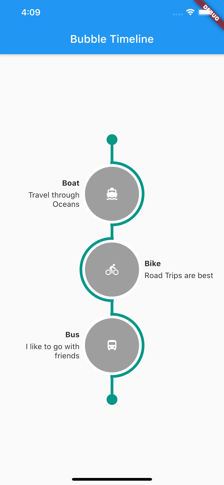

# bubble_timeline

A Flutter Widget to make interactive timeline widget.

## Screenshots



## Installing

To use this package:

Add the following to your `pubspec.yaml` file:

```yaml
dependencies:
    bubble_timeline:
```

## How to Use

Simply create a `BubbleTimeline` widget, and pass the required params:

```dart
 BubbleTimeline(
    bubbleDiameter: 120,
    // List of Timeline Bubble Items
    items: [
        TimelineItem(
            title: 'Boat',
            subtitle: 'Travel through Oceans',
            icon: Icon(
                Icons.directions_boat,
                color: Colors.white,
            ),
            bubbleColor: Colors.grey,
        ),
        TimelineItem(
            title: 'Bike',
            subtitle: 'Road Trips are best',
            icon: Icon(
                Icons.directions_bike,
                color: Colors.white,
            ),
            bubbleColor: Colors.grey,
        ),
        TimelineItem(
            title: 'Bus',
            subtitle: 'I like to go with friends',
            icon: Icon(
                Icons.directions_bus,
                color: Colors.white,
            ),
            bubbleColor: Colors.grey,
        ),
    ],
    stripColor: Colors.teal,
    scaffoldColor: Colors.white,
)        
```


Use `TimelineItem` to add items in Timeline.

```dart
TimelineItem(
    title: 'Title',
    subtitle: 'Subtitle',
    description: 'Description',
    icon: Icon(
        Icons.directions_bus,
    ),
    bubbleColor: Colors.blue,
),
```


